<div align="center">

# 📚 Library Management System

**A role-based Windows desktop application for managing books, members, employees and the complete book issue/return cycle.**


*CSC2210: Object Oriented Programming 2 — Project Report · Spring 2024-2025 · Section Q · Group 04*
*American International University-Bangladesh (AIUB) · Faculty of Science & Technology · Department of Computer Science*

</div>

---

## 📑 Table of Contents

1. [Overview](#-overview)
2. [Team](#-team)
3. [User Roles & Features](#-user-roles--features)
4. [Tech Stack](#-tech-stack)
5. [Project Structure](#-project-structure)
6. [Database Design](#-database-design)
7. [Getting Started](#-getting-started)
8. [How It Works](#-how-it-works)
9. [Screenshots](#-screenshots)
10. [Future Work](#-future-work)
11. [Acknowledgements](#-acknowledgements)

---

## 📖 Overview

The **Library Management System** is a desktop application (C# Windows Forms) built to simplify and streamline the day-to-day operations of a library. It provides a user-friendly interface for managing **books, employees and members (students)**, and keeps accurate records of every book transaction through detailed activity logs.

By automating issuing, returning and record keeping, the system improves accuracy, reduces manual errors and saves time for both library staff and students.

The system has two types of users, each with their own responsibilities: the **Admin** and the **Librarian**.

---

## 👥 Team

| No. | Name | Student ID |
|:---:|------|:----------:|
| 1 | Tafsir Rahman | 23-51061-1 |
| 2 | MD. Maharab Khan | 23-50118-1 |
| 3 | ABU Musfiq Rahat | 23-51074-1 |

**Supervised by:** Md. Hasibul Hasan — CSC2210 Object Oriented Programming 2, AIUB

---

## ✨ User Roles & Features

### 🛡️ Admin — oversees the whole library

| Feature | Description |
|---------|-------------|
| **Dashboard** | Live statistics cards: **Total Books, Available Books, Issued Books, Total Employees** (librarians). |
| **Book Details** | Add, update and delete books in the catalog. Book IDs are generated automatically (`b-XXXX`). |
| **Employee Details** | Add, update and delete employees (name, position, contact, salary, gender). Employee IDs are generated automatically (`e-XXX`). Includes validation for empty fields and numeric salary. |
| **Activity Log** | View every **issued** and **returned** book, including *days issued* / *days kept*, to monitor the whole circulation process. |
| **Logout** | Returns to the login screen. |

### 🧑‍💼 Librarian — handles daily operations

| Feature | Description |
|---------|-------------|
| **Members → Add New Member** | Register a student (name, enrollment no., department, semester, contact, email). Student IDs are generated automatically (`s-XXXX`). |
| **Members → View Members** | Browse all students, **search by name as you type**, then update or delete a selected member. |
| **Issue Books** | Look up a student by enrollment number, pick a book and issue date, and issue the book. |
| **Return Books** | Look up a student, select one of their currently issued books, choose the return date and return it. |
| **Activity Log** | View all issued and returned books. |
| **Exit** | Returns to the login screen. |

### 🔐 Common Features

- **Role-based login** — the `UserInfo` table decides whether the user is sent to the **Admin** panel or the **Librarian** panel. The librarian's name is displayed on the welcome screen.
- **Transaction-safe circulation** — issuing and returning a book update the issue record and the book quantity together inside a **SQL transaction** (rolled back on failure).
- **Business rules** enforced when issuing a book:
  - the book must be in stock (`bQuantity > 0`)
  - the same student cannot hold the same book twice at the same time
  - both a student and a book must be selected
- **Confirmation dialogs** before deleting books, employees or members.

---

## 🧰 Tech Stack

| Layer | Technology |
|-------|------------|
| Language | C# |
| Framework | .NET Framework 4.7.2 |
| UI | Windows Forms (WinForms) with `DataGridView`, `DateTimePicker`, `ComboBox`, `MenuStrip` |
| Database | Microsoft SQL Server |
| Data access | ADO.NET (`System.Data.SqlClient`) through a reusable `DataAccess` class |
| IDE | Visual Studio 2017 or newer |
| Design approach | Object-oriented design, ER modelling, normalization (1NF → 2NF) |

---

## 🗂️ Project Structure

```
WFALibraryManagement/
├── Program.cs                 # Entry point → opens LoginPage
├── DataAccess.cs              # Reusable ADO.NET data-access class
├── App.config                 # Connection string & .NET runtime config
│
├── LoginPage.cs               # Role-based authentication
├── Admin.cs                   # Admin dashboard (statistics + navigation)
├── Librarian.cs               # Librarian dashboard (menu strip)
│
├── BookDetails.cs             # Book CRUD (Admin)
├── EmployeeDetails.cs         # Employee CRUD (Admin)
├── AddStudent.cs              # Register members (Librarian)
├── ViewStudent.cs             # Search / update / delete members (Librarian)
├── IssueBooks.cs              # Issue a book (Librarian)
├── ReturnBooks.cs             # Return a book (Librarian)
├── ActivityLog.cs             # Issued & returned book history
│
├── *.Designer.cs / *.resx     # WinForms designer files and resources
├── tafsirDBDataSet.xsd        # Typed dataset
├── Resources/                 # Images used in the UI
├── Properties/                # Assembly info, settings and resources
└── WFALibraryManagement.csproj
```

Each form follows the same pattern: a `DataAccess` object (`Da`) is created in the constructor and used for every database call.

---

## 🗄️ Database Design

**Database name:** `tafsirDB` (SQL Server)

### Entity–Relationship Diagram

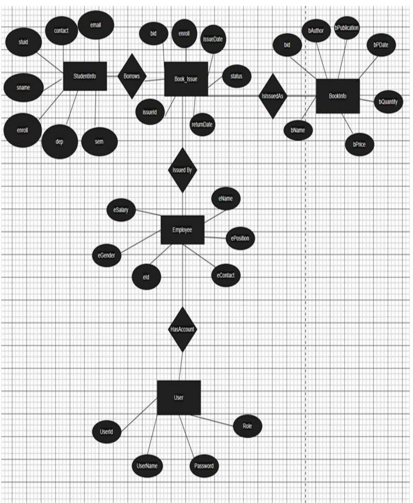

The ER model contains five entities: **StudentInfo**, **Book_Issue** (`IssuedBooks` in code), **BookInfo**, **Employee** and **User**, connected by the relationships *Borrows*, *IsIssuedAs*, *Issued By* and *HasAccount*.

### Tables (as used by the code)

| Table | Columns |
|-------|---------|
| `UserInfo` | `UserID` (PK), `UserName`, `Password`, `Role` (`admin` / `librarian`) |
| `EmployeeInfo` | `eid` (PK, e.g. `e-1001`), `eName`, `ePosition`, `eContact`, `eSalary`, `eGender` |
| `StudentInfo` | `stuid` (PK, e.g. `s-1001`), `sname`, `enroll`, `dep`, `sem`, `contract` *(contact number)*, `email` |
| `BookInfo` | `bid` (PK, e.g. `b-1001`), `bName`, `bAuthor`, `bPublication`, `bPDate`, `bPrice`, `bQuantity` |
| `IssuedBooks` | `issueId` (PK, identity), `bid` (FK), `enroll` (FK), `issueDate`, `returnDate`, `status` (`Issued` / `Returned`) |

### Normalization

The report normalizes each relationship from UNF to 2NF, for example:

- **StudentInfo ↔ Book_issue** → student attributes are separated from the issue record (`bid` PK, `sid` FK)
- **Book_issue ↔ BookInfo** → book details are separated from the issue record
- **Book_issue ↔ Employee** → employee details are separated and linked by key
- **Employee ↔ User** → account data (`UserId`, `UserName`, `Password`, `Role`) is separated from employee data

### Starter SQL

The SQL script is not part of the repository, so this is a starting schema **inferred from the queries in the code**. Adjust data types as you like.

<details>
<summary><b>Click to expand the starter SQL</b></summary>

```sql
CREATE DATABASE tafsirDB;
GO
USE tafsirDB;
GO

CREATE TABLE UserInfo (
    UserID    VARCHAR(20) PRIMARY KEY,
    UserName  VARCHAR(100) NOT NULL,
    Password  VARCHAR(100) NOT NULL,
    Role      VARCHAR(20)  NOT NULL          -- 'admin' or 'librarian'
);

CREATE TABLE EmployeeInfo (
    eid        VARCHAR(20) PRIMARY KEY,
    eName      VARCHAR(100),
    ePosition  VARCHAR(50),
    eContact   VARCHAR(20),
    eSalary    DECIMAL(10,2),
    eGender    VARCHAR(10)
);

CREATE TABLE StudentInfo (
    stuid     VARCHAR(20) PRIMARY KEY,
    sname     VARCHAR(100),
    enroll    VARCHAR(20) UNIQUE,
    dep       VARCHAR(50),
    sem       VARCHAR(10),
    contract  VARCHAR(20),
    email     VARCHAR(100)
);

CREATE TABLE BookInfo (
    bid          VARCHAR(20) PRIMARY KEY,
    bName        VARCHAR(200),
    bAuthor      VARCHAR(100),
    bPublication VARCHAR(100),
    bPDate       DATE,
    bPrice       BIGINT,
    bQuantity    BIGINT
);

CREATE TABLE IssuedBooks (
    issueId    INT IDENTITY(1,1) PRIMARY KEY,
    bid        VARCHAR(20) REFERENCES BookInfo(bid),
    enroll     VARCHAR(20) REFERENCES StudentInfo(enroll),
    issueDate  DATE,
    returnDate DATE NULL,
    status     VARCHAR(20) NOT NULL DEFAULT 'Issued'   -- 'Issued' / 'Returned'
);

-- Sample logins
INSERT INTO UserInfo VALUES ('u-001', 'Admin',   'adm', 'admin');
INSERT INTO UserInfo VALUES ('u-002', 'musfiq',  'lib', 'librarian');
```

</details>

### Key SQL Operations

The application uses 26 SQL statements. Highlights:

| Purpose | Example |
|---------|---------|
| Total books | `SELECT SUM(CAST(bQuantity AS INT)) FROM BookInfo` |
| Issued books count | `SELECT COUNT(*) FROM IssuedBooks WHERE status = 'Issued'` |
| Librarian count | `SELECT COUNT(*) FROM EmployeeInfo WHERE ePosition = 'librarian'` |
| Issue a book | `INSERT INTO IssuedBooks (bid, enroll, issueDate) VALUES (...)` + `UPDATE BookInfo SET bQuantity = bQuantity - 1` |
| Return a book | `UPDATE IssuedBooks SET returnDate = ..., status = 'Returned'` + `UPDATE BookInfo SET bQuantity = bQuantity + 1` |
| Auto ID generation | `SELECT MAX(eid) FROM EmployeeInfo` (same for `bid`, `stuid`) |
| Member search | `SELECT * FROM StudentInfo WHERE sname LIKE '...%'` |

---

## 🚀 Getting Started

### Prerequisites

- Windows 10 / 11
- **Visual Studio** (2017 or later) with the **.NET desktop development** workload
- **.NET Framework 4.7.2** developer pack
- **Microsoft SQL Server** (Express edition is enough) and SQL Server Management Studio (SSMS)

### Installation

1. **Clone the repository**

   ```bash
   git clone https://github.com/<your-username>/<repo-name>.git
   ```

2. **Create the database** — open SSMS, run the [starter SQL](#starter-sql), and insert your books, students and employees (or start from the sample logins).

3. **Configure the connection string.** It is currently set in two places, so update **both** to match your own server:

   - `DataAccess.cs`
   - `App.config`

   ```csharp
   new SqlConnection(@"Data Source=YOUR_SERVER_NAME;Initial Catalog=tafsirDB;Persist Security Info=True;User ID=YOUR_USER;Password=YOUR_PASSWORD;");
   ```

   > 💡 Use `.\SQLEXPRESS` as `YOUR_SERVER_NAME` for a local SQL Server Express instance. Make sure SQL Server authentication is enabled for the user you choose.

4. **Open** `WFALibraryManagement.csproj` (or the `.sln`) in Visual Studio.

5. **Build & run** — press **F5**. The application starts on the **Login** screen.

### Default Access

Log in with the `UserID` and `Password` from the `UserInfo` table:

| Role | Opens |
|------|-------|
| `admin` | Admin dashboard (books, employees, activity log) |
| anything else (e.g. `librarian`) | Librarian panel (members, issue, return, activity log) |

---

## 🔄 How It Works

```
                       ┌────────────────┐
                       │   LoginPage    │  UserInfo → Role
                       └───────┬────────┘
              ┌────────────────┴────────────────┐
              ▼                                 ▼
     ┌─────────────────┐               ┌──────────────────┐
     │      ADMIN      │               │    LIBRARIAN     │
     │    Dashboard    │               │  Welcome + Menu  │
     └────────┬────────┘               └────────┬─────────┘
              │                                 │
   ┌──────────┼───────────┐        ┌────────────┼──────────────┬────────────┐
   ▼          ▼           ▼        ▼            ▼              ▼            ▼
 Book      Employee    Activity  Members     Issue Books   Return Books  Activity
 Details   Details       Log    (Add/View)                                 Log
```

**Issue a book**
1. Enter the student's enrollment number → student details are loaded.
2. Choose a book and issue date.
3. The system checks stock and duplicate issues, then — in one transaction — inserts the issue record and decreases the book quantity.

**Return a book**
1. Enter the enrollment number → the student's currently issued books are listed with *days issued*.
2. Select a book and a return date.
3. In one transaction, the record is marked `Returned` with the return date, and the book quantity is increased by one.

---

## 🖼️ Screenshots

### Login
Role-based sign-in for Admin and Librarian.

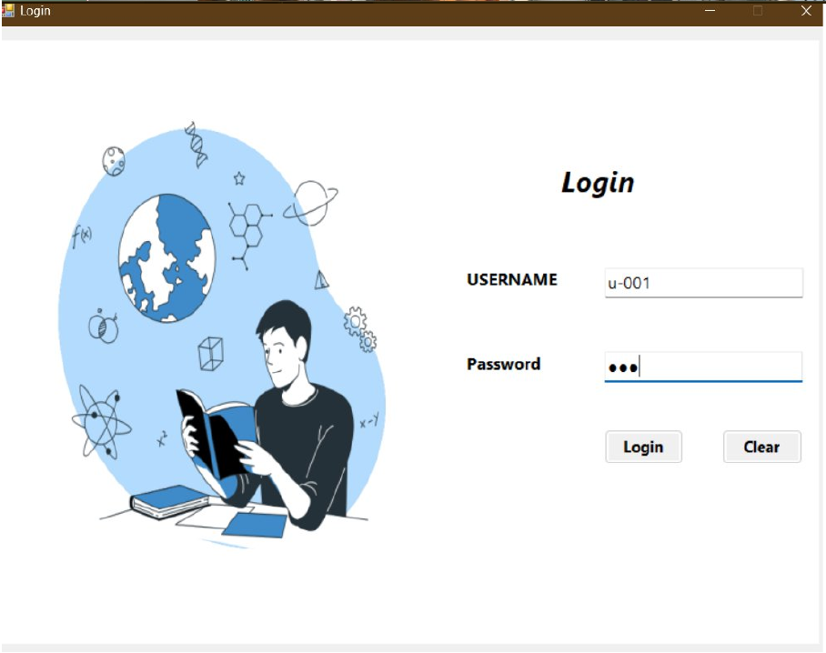

### Admin Module

**Admin Dashboard** — total, available and issued books plus total employees.

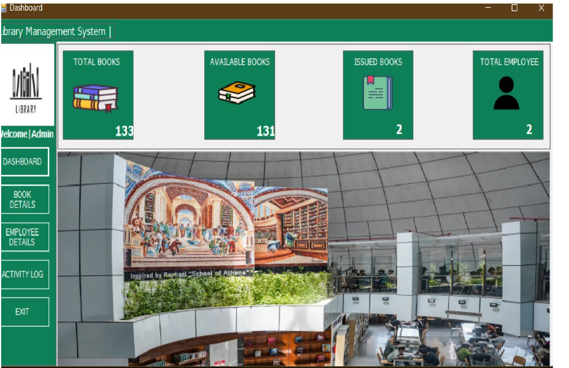

**Book Details** — add, update, delete and clear book records.

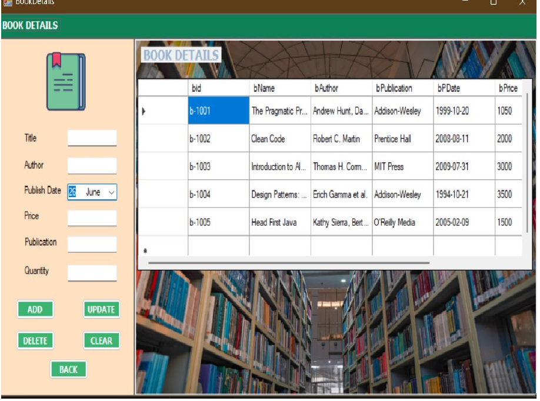

**Employee Details** — manage library staff.

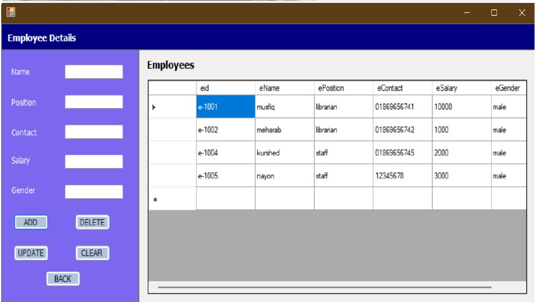

### Librarian Module

**Librarian Dashboard** — menu bar with Members, Issue Books, Return Books, Activity Log and Exit.

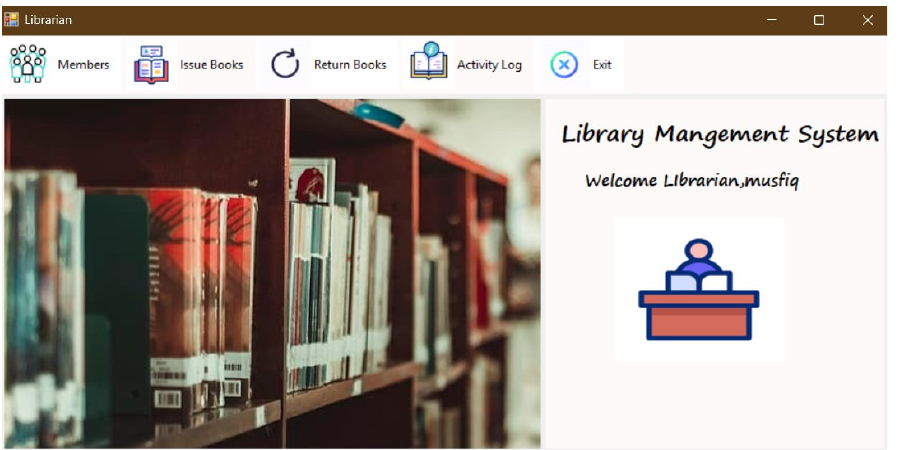

**Add Student** — register a new library member.

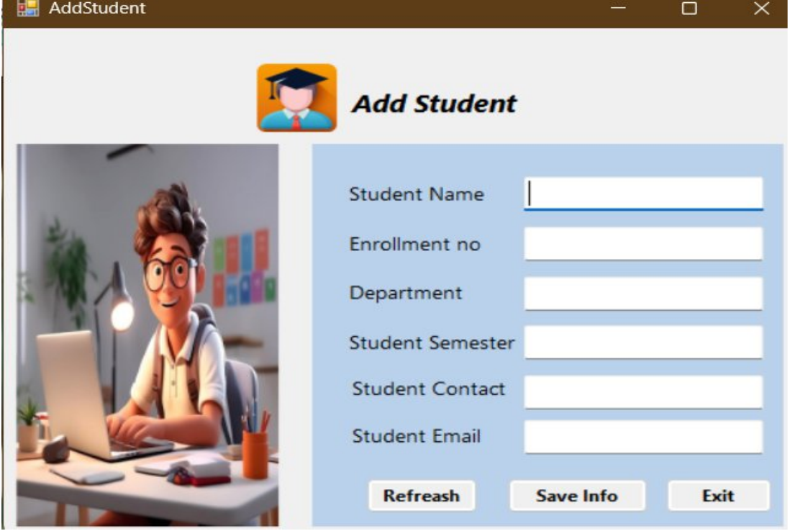

**View Students** — search by name, then update or delete a member.

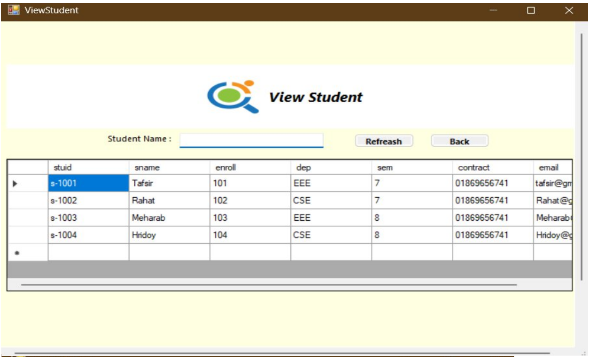

**Issue Books** — find a student by enrollment number and issue a book.

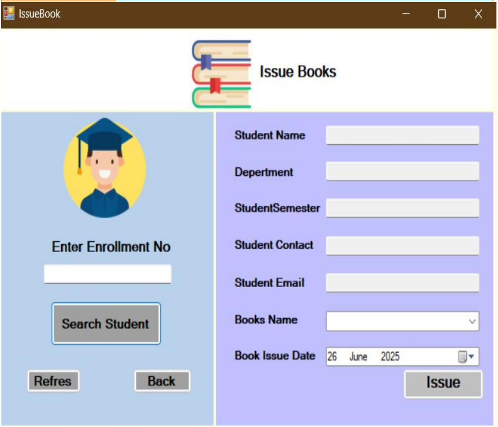

**Return Books** — select an issued book and record its return.

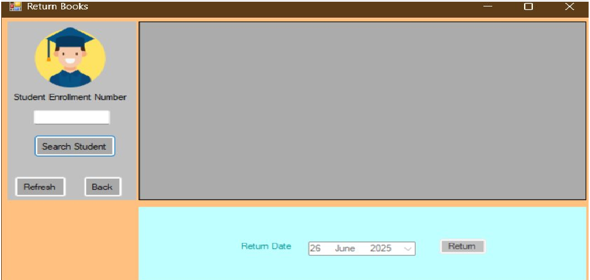

**Activity Log** — all issued and returned books with days issued / days kept.

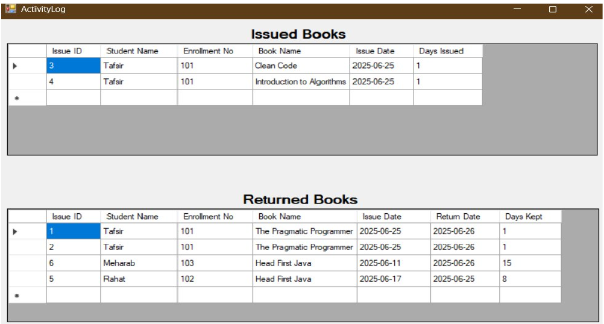

---

## 🔮 Future Work

- Late-return **fine calculation** and due dates
- Password **hashing** and secure storage of the database credentials
- **Parameterized queries** across all forms
- Book **search and filtering** by title, author or publication
- A **student self-service** portal to view borrowed books
- **Reports** and export to PDF / Excel
- Email / SMS reminders for overdue books
- Barcode / QR-code scanning for books and student cards

---

## 🙏 Acknowledgements

- **Md. Hasibul Hasan** — course supervisor, CSC2210 Object Oriented Programming 2, AIUB
- American International University-Bangladesh (AIUB), Faculty of Science & Technology, Department of Computer Science

---

<div align="center">

Made with ❤️ by **Tafsir Rahman**, **MD. Maharab Khan** & **ABU Musfiq Rahat** · AIUB · Group 04

</div>
