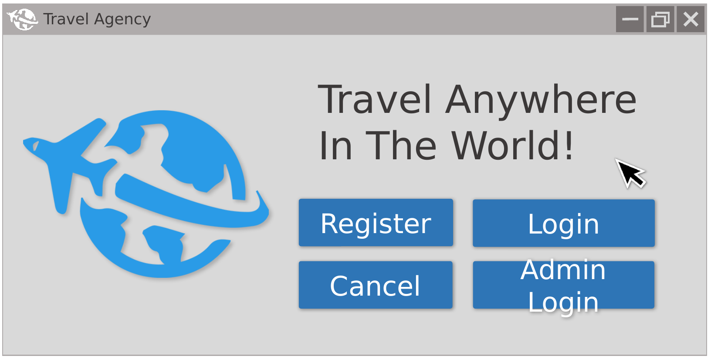
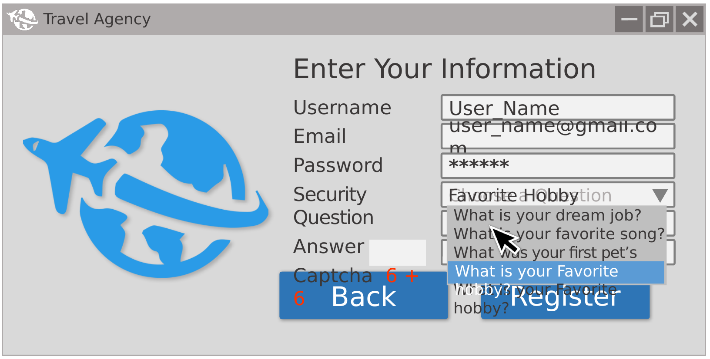
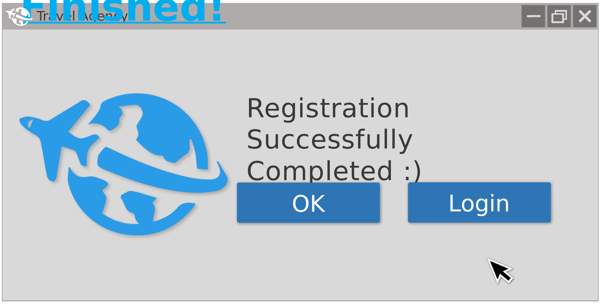
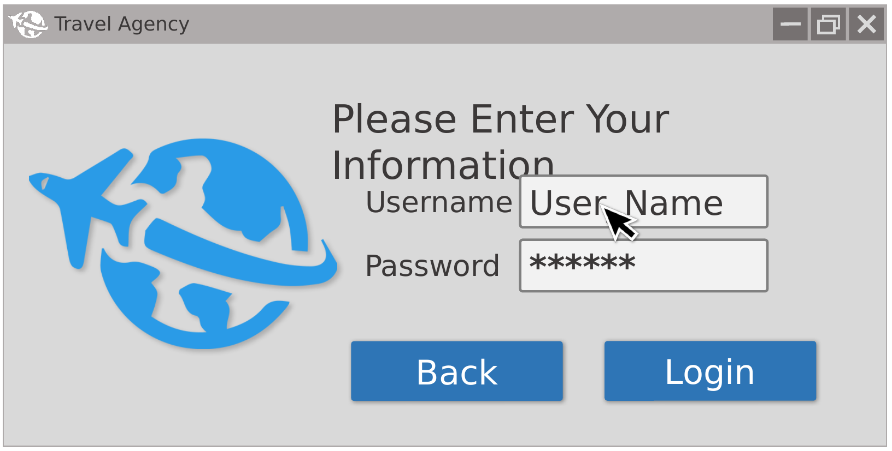
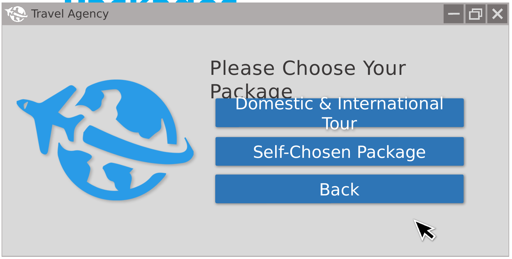
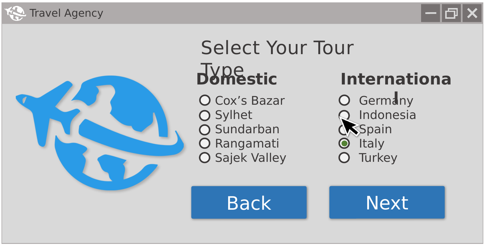
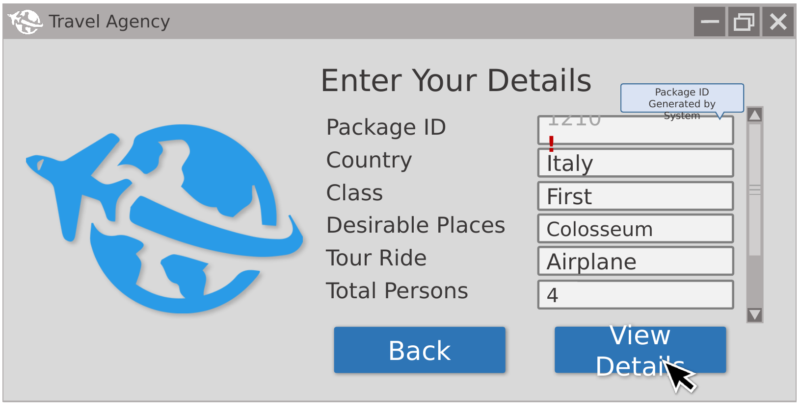
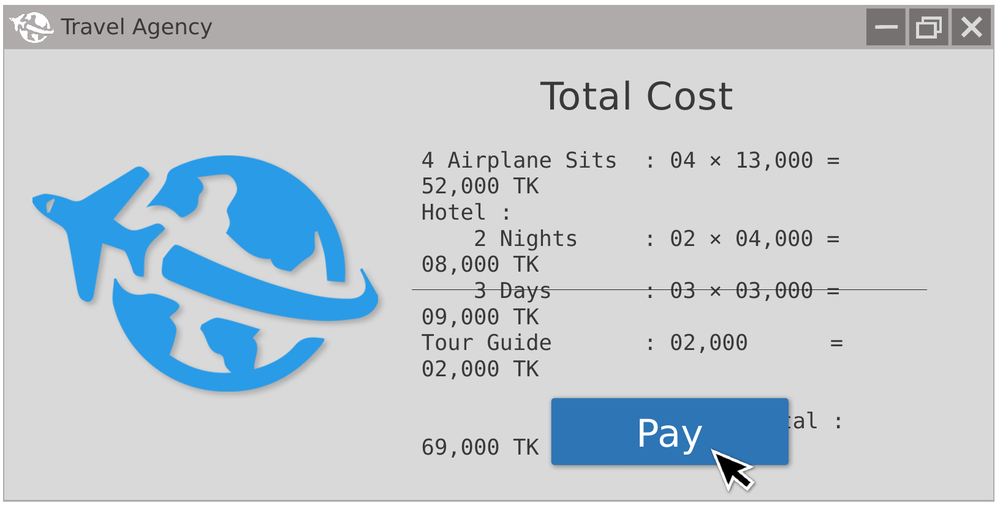
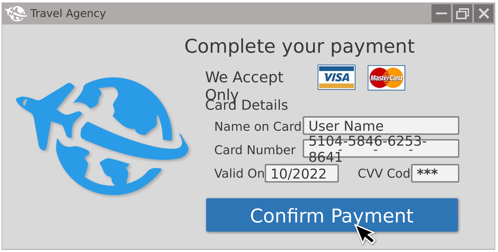
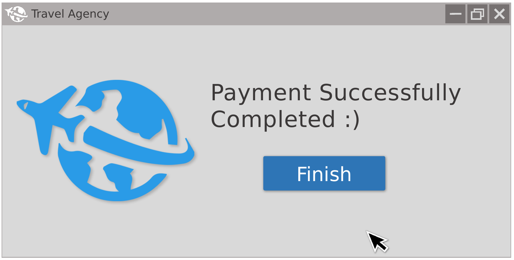

# ✈️ Travel Agency Management System

A Java Swing desktop application that lets travellers register, browse domestic and international tour packages (or build a custom one), calculate the total cost, and pay by card — while an administrator manages user accounts. Data is stored in plain text files, so no database setup is needed.

  

---

## 📑 Table of Contents
1. [Features](#-features)
2. [Application Flow](#-application-flow)
3. [Screenshots](#-screenshots)
4. [Tour Packages](#-tour-packages)
5. [Cost Calculation](#-cost-calculation)
6. [Project Structure](#-project-structure)
7. [Getting Started](#-getting-started)
8. [Future Work](#-future-work)

---

## ✨ Features

**Traveller**
- Registration with username, email, password, a security question/answer and a random math captcha
- Login with validation of stored credentials
- **Default tour packages** – Domestic and International destinations, each with three tiers (First / Second / Third class)
- **Self-chosen package** – pick destination, number of persons, hotel type, days and vehicle; the cost is calculated instantly
- Card payment form (Visa / MasterCard) with field validation
- Payment confirmation screen

**Administrator**
- Separate admin login (default credentials: `admin` / `admin`)
- View, add and delete registered users
- Change the admin password

---

## 🔄 Application Flow

```
Welcome ─► Home ─┬─► Register ─► Registration Success ─► Login
                 ├─► Login ─────┐
                 └─► Admin Login ─► Admin ─► User Data (view / add / delete)
                                          └─► Admin Password

Login ─► Packs ─┬─► Default Packs ─► Domestic / International ─► Place / Country ─► 3 Packs ─┐
                └─► Self-Chosen Packs (cost calculator) ──────────────────────────────────┤
                                                                                           ▼
                                                                      Payment ─► Payment Success
```

---

## 🖼️ Screenshots

### Welcome


### Registration
Users enter their details, choose a security question and solve a captcha.



### Registration Success


### Login


### Choosing a Package
Choose between a ready-made Domestic & International tour or a Self-Chosen package.



### Package Types
Select a domestic place or an international country.



### Package Details
A package ID is generated by the system along with the selected country, class, places, ride and number of persons.



### Total Cost
Itemised breakdown of airfare, hotel, days and tour guide.



### Payment
Only Visa and MasterCard are accepted.



### Payment Success


---

## 🧳 Tour Packages

| Type | Destinations |
|------|--------------|
| **Domestic** | Bandarban, Cox's Bazar, Rangamati, Sajek Valley, Sreemangal |
| **International** | France, Greece, Indonesia, Italy, South Africa |

Every destination offers three packages:

| Pack | Class | Hotel | Persons | Duration |
|------|-------|-------|---------|----------|
| Pack 1 | First Class | 5 Star | 5 | 6 days |
| Pack 2 | Second Class | 3 Star | 4 | 4 days |
| Pack 3 | Third Class | 2 Star | 4 | 3 days |

---

## 💰 Cost Calculation (Self-Chosen Package)

**International** = `$100 base` + country fee + `$200 × persons` + `hotel rate × days`

| Country | Fee | Hotel | Per day |
|---------|-----|-------|---------|
| Italy | $300 | Lodge | $50 |
| Germany | $280 | Motel | $69 |
| Greece | $269 | Local | $80 |
| Indonesia | $250 | 3 Star | $120 |
| South Africa | listed in app | 5 Star | $220 |

**Domestic** = `10,000 TK base` + place fee + `2,000 TK × persons` + `hotel rate × days` + vehicle fare

- Hotel per day: 2,000 / 3,500 / 5,000 / 8,000 / 12,000 TK
- Vehicles: Train (AC sleeping 750, AC seating 520, AC 440, non-AC 250), Bus (AC 2,500, non-AC 900), Airplane (12,000 TK)

---

## 📂 Project Structure

```
Travel-Agency/
├── Start.java                 # Entry point – launches Welcome
├── Welcome.java / Home.java   # Landing and main menu
├── Registration.java / Login.java
├── Packs.java                 # Default vs. self-chosen choice
├── DefPackTypes.java          # Domestic / International selection
├── DomPlaces.java / IntCountries.java
├── Domestic*.java             # Bandarban, CoxsBazar, Rangamati, SajekValley, Sreemangal
├── International*.java        # France, Greece, Indonesia, Italy, SouthAfrica
├── SelfChoosenPacks.java      # Custom package + cost calculator
├── Payment.java / PaySuccess.java
├── AdminLogin.java / Admin.java / AdminAdd.java
├── AdminPassword.java / UserData.java
├── images/                    # Logos, card images, backgrounds
└── Data/
    ├── user_data.txt          # Registered users
    └── admin_data.txt         # Admin credentials
```

---

## 🚀 Getting Started

**Requirements:** JDK 8 or later.

```bash
# Clone the repository
git clone <your-repo-url>
cd Travel-Agency

# Compile
javac *.java

# Run
java Start
```

Or open the project in NetBeans / IntelliJ / Eclipse and run `Start.java`.

> **Note:** File paths are written Windows-style (`.\Data\...`). On Linux/macOS, change them to `./Data/...` and run from the project root so `Data/` and `images/` resolve correctly.

---

## 🔭 Future Work

- Replace text-file storage with a database (MySQL / SQLite)
- Hash passwords instead of storing plain text
- Store and display booking history per user
- Add more destinations and dynamic package management from the admin panel
- Responsive layouts instead of absolute positioning
- Real payment gateway integration and email confirmations
